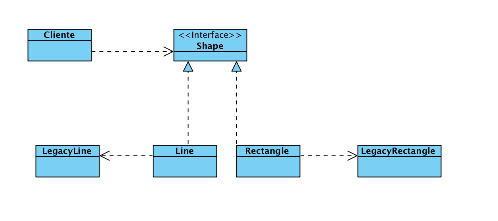

# Adaptador

## Intención

- Convertir la interfaz de una clase en otra interfaz.
- Soluciona problemas de incompatiblidades entre clases debido a las interfaces.

## Problema

Se quiere acoplar un nuevo modulo de software a nuestra aplicación pero no presenta ninguna compatiblidad en cuanto a la arquitectura.

## Discusión

En ocasiones reutilizar código nos puede suponer más problemas que soluciones ya que puede resultar muy complicado de unir modulos a nuestra aplicación, sobre todo si estos modulos están obsoletos y nuestra aplicación usa una nueva tecnología.

Se pueden presentar también problemas temporales y de sincronización.

Con este patrón conseguiremos realizar una adaptación (mapeo o traducción) de un componente antiguo que sea consistente a nuestro sistema.

Los clientes realizaran llamadas al objeto que instancia el adaptador y este les dirige al método del componente heredado. Se puede plantear como hererncia o agregación.

Adaptador funciona como una envoltura o modificador de una clase existente.

## Estructura

## Verificación

1. Identificar el componente que se quiera adaptar (adaptado) y su cliente.
2. Identificar la interfaz que el cliente necesite.
3. Diseñar clase contenedora que usa el cliente, en esta clase figura una instancia del adaptador.

## Conclusiones

- Adapador se usa después de tener completas las clases, sin embargo Bridge se puede usar de forma previa ya que puede variar la abstracción y la aplicación por separado.

- Adaptador proporciona una interfaz distinta a su sujeto. Proxy proporciona la misma interfaz. Decorador proporciona una mejorada.
