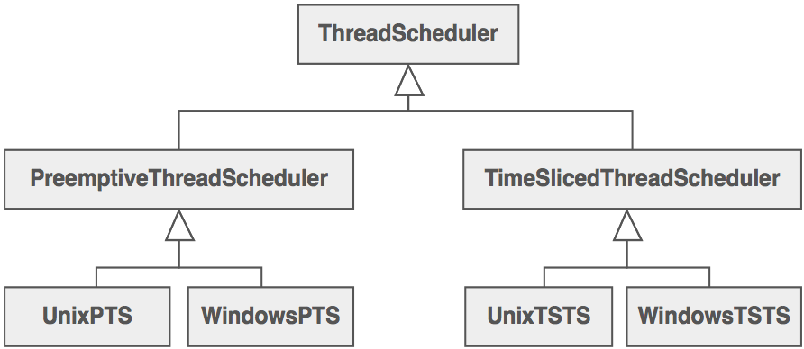
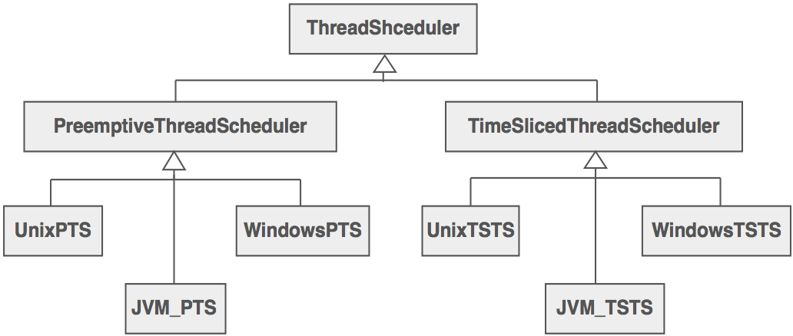
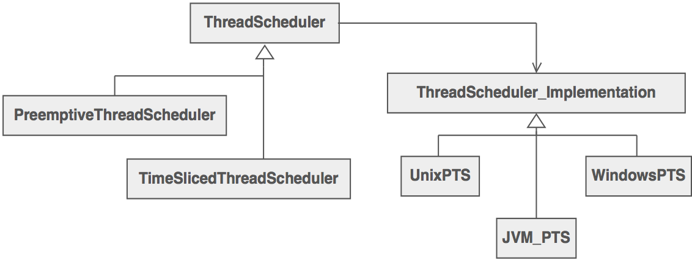

Bridge
=======

##Intención

- Desacoplar la abstracción de la implementación para que los dos puedan variar independientemente.
- Publicar una interfaz de la abstracción en una jerarquía de herencia, publicar la implementación en otra jerarquía de herencia.
- Más que encapsular lo que se trata es de aislar.

##Problema

Se quieren diferentes tipos de implementaciones mediante el uso de subclases para una clase base abstracta. Esto produce un bloque en tiempo de compilación entre la interfaz y su implementación. La abstracción y la implementación no pueden ser extendidos o compuestos de forma independiente.

##Motivación

Consideremos el problema de un planificador de tareas.

Hay dos tipos de planificadores de tareas, y hay dos tipos de Sistemas Operativos. Teniendo en cuenta este enfoque a la especialización tenemos que definir una clase que nos permita permutar entre las implementaciones. Si tuvieramos que añadir una nueva plataforma por ejemplo una JavaVM tendriamos algo asi:

Y así sucesivamente, por lo que tendríamos como número de clases el producto entre el número de esquemas de programación y el número de plataformas.

El patrón Bridge propone una refactorización de esta jerarquía de clases en dos jerarquías ortogonales uno para abstacciones independientes de las plataformas (SO), y el otro para las implementaciones dependientes de las plataformas.

##Discusión

La clase interfaz contiene un puntero a la clase de implementación abstracta. Este puntero se inicializa con una instancia de la clase de implementación concreta. El cliente interactúa con la clase interfaz, y a su vez esta *delega* todas las peticiones a la clase de la implementación.

Se hace de esta manera para encapsular la implementación y asegurarse de que pueda seguir evolucionando, o sustituir en su totalidad (en tiempo de ejecución).

##Estructura

##Verificación

1. Decidir si existen dos dimensiones ortogonales en el dominio. Estos conceptos independientes podrían ser: abstracción/plataforma, dominio/infraestructura, front-end/back-end, o interfaz/implementación.
2. Diseñar una separación de responsabilidades: Qué desea el cliente, y que plataformas se nos proporciona.
3. Diseñar una interfaz orientada a la plataforma que sea mínima, necesaria y suficiente. Objetivo de desacople de la abstracción de la plataforma.
4. Definir una interfaz o clase derivada por cada plataforma.
5. Crear una clase base abstracta como plataforma base de objetos y que delegue su funcionalidad en las derivadas.

##Conclusiones

- Adaptador hace que las cosas funcionen una vez están diseñadas; Bridge hace que funcionen antes de que lo estén.
- Bridge está diseñado para que la abstracción y la implementación varien independientemente.
- Los patrones Estado, Estrategia, Bridge y Adaptador tienen soluciones similares.
- Las estructuras de Estado y Bridge son idénticas (salvo porque Bridge admite jerarquías). Estado permite que el comportamiento de un objeto cambie junto con su estado, mientras que Bridge desacopla una abstracción de su implementación para que los dos se puedan variar independientemente.
- Si una clase interfaz delega la creación de objetos en las clases derivadas en cuanto a diseño es mejor usar una Factoria Abstracta.