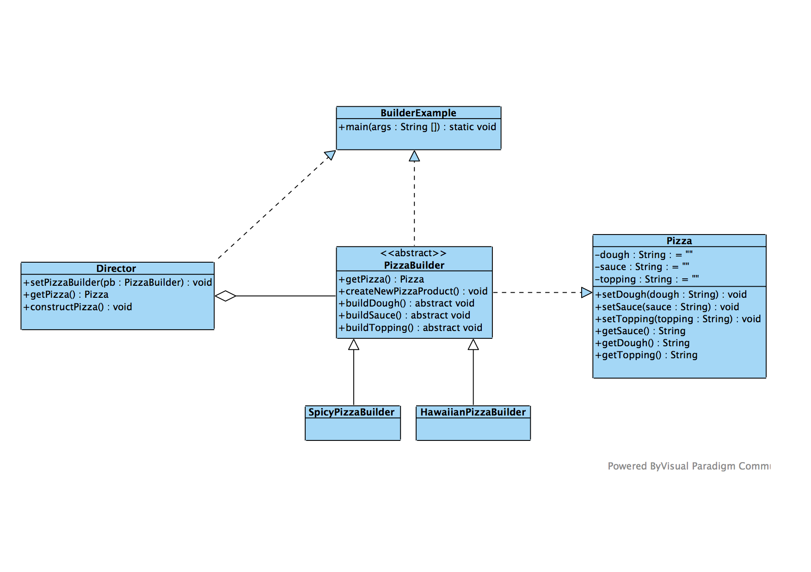

Builder
=======

##Intención

Separa la construcción de un objeto de su representación para que le mismo proceso de construcción pueda crear diferentes representaciones.

##Problema

Como tenemos la implementación separada, en algunas representaciones tendremos problemas ya que necesitarán un constructor en la misma clase.

##Discusión

Como tenemos separado el algoritmo podríamos a realizar diferentes construcciones segun el producto (ej. ASCII, TeX, RTF).

Proporciona un mayor control sobre el proceso de construcción.

##Estructura

##Verificación

1. Encapsular el análisis sintáctico de la entrada común en una clase "Director".
2. Diseñar un protocolo estándar para la creación de todas las posibles representaciones de salida en una interfaz constructor.
3. Definir clase **Builder** derivada para cada representación.
4. Cliente crea **Director** y **Builder**, registra el último con el primero.
5. Cliente le indica al director qué quiere construir.
6. Cliente solicita al director que le devuelva un resultado.

##Conclusiones

- Builder tiene sinergia con Singleton.
- Builder se centra en construir objetos complejos paso a paso. Sin embargo Factoría Abstracta hace hincapié en una familia de objetos producto.
- Builder devuelve el producto como un paso final, mientras que Factoría Abstracta lo devuelve inmediatamente.