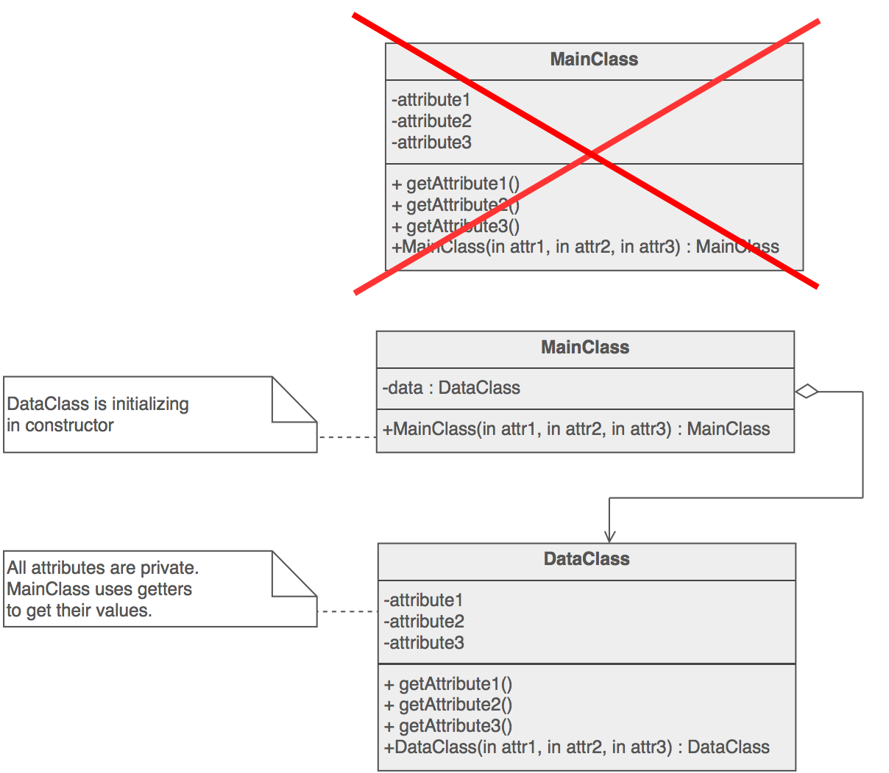

Inmutable
=======

##Intención

- Encapsular los datos de inicialización de la clase.
- Separar los datos de los métodos que los utilizan.
- Evitar que se sobreescriban los atributos.
- Proporcionar el valor de `final` después de construir el objeto.

##Problema

Una clase puede exponer sus atributos pero a modo de sólo lectura trás realizar la instanciación del objeto.

El principal objetivo es proteger el estado de la clase reduciendo al mínimo la visibilidad de sus atributos.

##Discusión

El patrón trata de limitar la visibilidad de sus datos.
Se reduce el número de atributos de clase encapsulandolos en el objeto. Permite al diseñador eliminar privilegios de escritura de atributos que se asignan únicamente durante la construcción.

##Estructura

##Verificación

1. Crear clase de datos. Mover a la clase de datos todos los atributos que necesitamos proteger.
2. Crear en la clase principal una instancia de la clase de datos.
3. Clase principal debe inicializar la instancia de la clase de datos a través de del constructor de la clase de datos.
4. Exponer cada **atributo de la clase de datos** a través de un **getter**.
5. Exponer cada atributo que es susceptible de cambiar a través de un **setter**.
