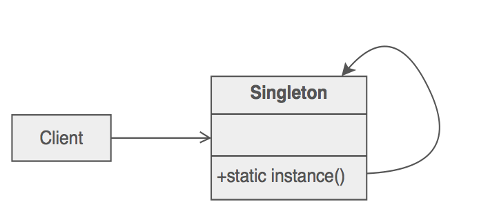
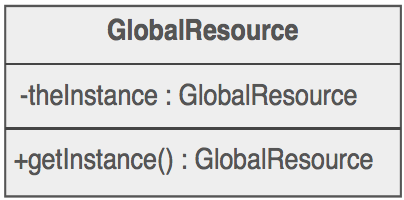

Singleton
===========

##Intención

- Asegurarnos de que una clase sólo tiene una única instancia y proporcionar una acceso global a ella.
- Encapsulación de propiedades en cuanto se crea el objeto por primera vez.

##Problema

Nuestra aplicación sólo necesita una única instancia de un objeto. Además la inicialización aplazada y el acceso global son estrictamente necesarios.

##Discusión

Hacer que la clase sea la resposable de la creación, inicialización y acceso. Declaramos una instancia como un dato miembro estático y privado. Proporcionamos un método miembro estático público que encapsula todo el código de inicialización y ofrece acceso a la instancia.

El cliente llama a la función de acceso (utilizando el nombre de la clase y el operador de resolución del espacio de nombres) siempre que se requiera una referencia a dicha instancia.

El patrón Singleton puede ser extendido para acceder a múltiples instancias.

Eliminar una instancia de la clase Singleton no resulta trivial como problema de diseño.

##Estructura

##Verificación

1. Definir un atributo `private static` de la única instancia.
2. Definir un método `public static` como acceso.
3. Realizar una *inicialización perezosa* en el método de acceso.
4. Definir todos los constructores como `protected` o `private`.
5. Los clientes sólo pueden usar el método de acceso para manipular el Singleton.

##Consideraciones

- Factoria Abstracta, Builder y Prototipo se pueden usar junto con Singleton.
- Fachada ocasionalmente es Singleton.
- El patrón Singleton muchos desarrolladores lo usan mal ya que sólo se debe usar cuando hay una única instancia de una clase. En muchas ocasiones lo usan en un intento equivocado para reemplazar variables globales.
- ¿Cuando es necesario?: cuando es más fácil pasar un objeto como referencia a los objetos que lo requieran, en lugar de dejar que los objetos tengan acceso al recurso a nivel global.
- Encontrar el equilibrio de la visibilidad de las propiedades de un objeto es crítico para mantener la flexibilidad.
